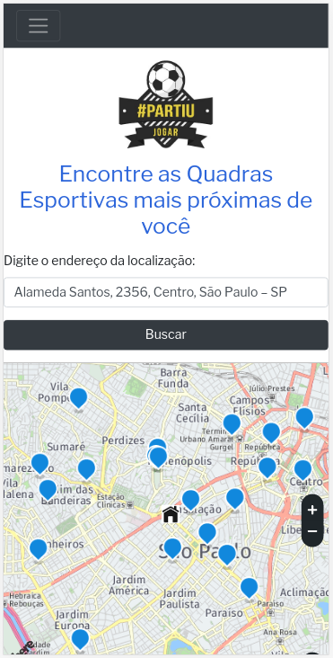

# Projeto Open House
## App de Busca de Quadras Esportivas #PartiuJogar

## Descrição da Aplicação
* Criar um produto de entretenimento utilizando APIs externas.
* UX: Aprofundamento dos conhecimentos de UX
* Internet: Aprender como é o funcionamento da internet, o que são e pra que servem (alguns) protocolos, como funciona a comunicação cliente-servidor e como fazer requisições.
* API REST: Descobrir como utilizar APIs, com exemplos práticos utilizando a API de Geolocalização. 
* Agilidade: Recapitulação dos conceitos de agilidade, como criar um projeto-base, o que são e para que servem alguns rituais/ferramentas de scrum e kanban.

## Linguagem de Programação
Essa página foi desenvolvida em JavaScript (ES6+), HTML e CSS.
Foi utilizado o Framework Bootstrap v4, foi consumido a API Here e foi utilizado o banco de dados Firebase.

## Roadmap do projeto
1. App onde os usuários possam encontrar locais para prática de esportes. O usuário poderá encontrar através de uma API de localização lugares próximos ou que tenha um esporte específico, conhecer melhor o lugar através de fotos 360° e fazer agendamento online.

Itens especificados:
* Localização
* Estado em que a quadra se encontra
* Preços
* Agenda com datas disponíveis
* Estacionamento
* Vestiários
* Lanchonete/Espaço para churrasco

Para as quadras cadastradas, será prestado serviço de divulgação com fotos do local em 360°, espaço para avaliação, controle de agendamento e pagamento. 

2. Para a versão 2, os usuários poderão sugerir suas quadras para o app oferecer seus serviços.

3. Para essa versão, fazer métodos de criação de times.

## Concorrência
Na busca por “quadras para alugar” retorna os sites das próprias quadras e por nome, não por localidade. Nesse caso o usuário necessita entrar de site em site para conhecer o local gerando um tempo considerável para a pesquisa.
Para sites de busca foi encontrado o Guia Mais e Sampa Online porém eles não tem opção de agendamento online.

## Entrevistas com Usuários
Na entrevista realizada com usuários foi mostrado que eles gostariam de ter um app para buscar as quadras mais próximas de sua região, conhecer o local com foto 360° e vídeos, saber as comodidades que existem no estabelecimento e poder locar online. 

Numa pesquisa com 78 pessoas, dentre elas mulheres e homens que jogam futebol, conseguimos os resultados abaixo:

## Personas
Aqui você encontra nossas personas, público que nos incentivou a dar início ao nosso projeto.  

## Histórias de usuário
Aqui você encontra a [história de usuários](https://drive.google.com/file/d/1_itpfioPYtlCzApJET9rtqVor4NtMgkr/view?usp=sharing)  

## Testes de Usabilidade
Após a eleboração de rafes, rescunhos e protótipos em papel, foi feito um protótipo de alta fidelidade e os testes de usuário deram como satisfatórios para pesquisar a quadra, agendar online e fazer o pagamento. 

Clique aqui para interagir com nosso [Protótipo](https://xd.adobe.com/view/a492e102-86c5-49ab-7b8f-bacf65139054-d2a3/?fullscreen)

## Business Model Canvas
Para esse projeto, seguimos o Business Model Canvas, pois ele mostra a visão de negócio de um modo mais simplificado, tornando fácil sua compreensão.  

## Foto do App
